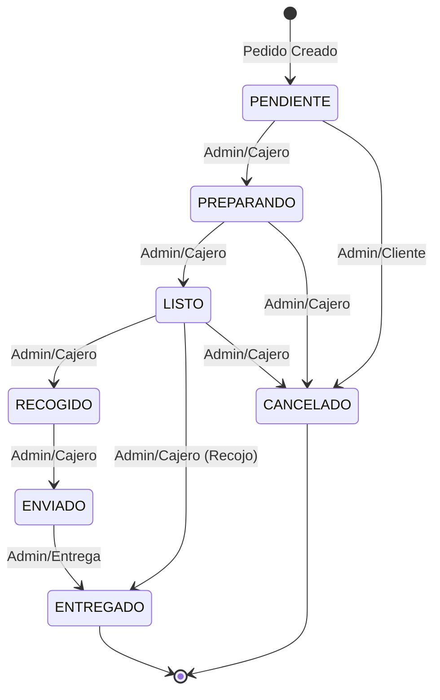

# Restaurante Delivery API — Documento de Pruebas (Testing)

## Índice de Contenidos

1. [Resumen de la Estrategia de Pruebas](#resumen-de-la-estrategia-de-pruebas)
2. [Infraestructura de Pruebas](#infraestructura-de-pruebas)
3. [Tablas de Partición de Equivalencia (EP)](#tablas-de-particion-de-equivalencia-ep)
4. [Análisis de Valores Límite (BVA)](#analisis-de-valores-limite-bva)
5. [Catálogo de Casos Extremos (Edge Cases)](#catalogo-de-casos-extremos-edge-cases)
6. [Pruebas de Vectores de Ataque](#pruebas-de-vectores-de-ataque)
7. [Pruebas de Máquina de Estados](#pruebas-de-maquina-de-estados)
8. [Escenarios de Pruebas de Integración](#escenarios-de-pruebas-de-integracion)
9. [Instrucciones de Ejecución de Pruebas](#instrucciones-de-ejecucion-de-pruebas)
10. [Resumen de Resultados Esperados](#resumen-de-resultados-esperados)
11. [Posibles Errores y Limitaciones Conocidas](#posibles-errores-y-limitaciones-conocidas)

---

## Resumen de la Estrategia de Pruebas

### Enfoque

La estrategia de pruebas utiliza un enfoque **multicapa** que garantiza la fiabilidad de todas las partes del sistema:

| Capa | Propósito | Herramientas |
|------|-----------|--------------|
| **Pruebas Unitarias/API** | Validar el comportamiento individual de cada endpoint | pytest + FastAPI TestClient |
| **Pruebas de Integración** | Validar los flujos de trabajo que involucran múltiples módulos | pytest + TestClient |
| **Pruebas de Seguridad** | Detectar inyecciones y fallos en el control de acceso | pytest + payloads diseñados |
| **Pruebas de Límites** | Validar límites de entrada y valores extremos | pytest.mark.parametrize |

### Técnicas de Diseño de Pruebas

1. **Partición de Equivalencia (EP)**: Divide los dominios de entrada en clases donde se espera que todos los valores produzcan el mismo comportamiento.
2. **Análisis de Valores Límite (BVA)**: Prueba los límites de las clases de equivalencia (mínimo, mínimo+1, máximo-1, máximo, y un punto justo fuera de cada límite).
3. **Pruebas de Máquina de Estados**: Valida todas las transiciones de estado (válidas e inválidas) a lo largo del ciclo de vida de un pedido.
4. **Pruebas de Vectores de Ataque**: Evalúa la protección contra inyecciones SQL, XSS, desbordamiento de búfer y saltos de autenticación (bypass).

### Objetivos de Cobertura

| Módulo | Mínimo de Pruebas | Técnicas Utilizadas |
|--------|-------------------|---------------------|
| Autenticación | 20 | EP, BVA, Casos Extremos, Ataques |
| Menú | 18 | EP, BVA, Casos Extremos, Ataques |
| Carrito | 15 | EP, BVA, Casos Extremos |
| Pedidos | 20 | EP, BVA, Máquina de Estados |
| Entrega | 15 | EP, BVA, Casos Extremos |
| Pagos | 18 | EP, BVA, Casos Extremos, Ataques |
| Inventario | 12 | EP, BVA, Casos Extremos |
| Reportes | 10 | EP, BVA, Casos Extremos |
| Integración | 15 | Flujos de principio a fin (E2E) |
| Seguridad | 10 | Vectores de Ataque |
| **Total** | **153+** | |

---

## Infraestructura de Pruebas

### Estrategia de Base de Datos

- **Base de datos de pruebas**: SQLite en memoria (`:memory:`) que permite ejecuciones ultrarrápidas.
- **Aislamiento**: Cada función de prueba obtiene una base de datos limpia (fixtures a nivel de función).
- **Sin efectos secundarios**: Las tablas se crean y se destruyen para cada prueba individual.

### Fixtures Disponibles

| Fixture | Alcance | Descripción |
|---------|---------|-------------|
| `client` | Función | Instancia de TestClient con BD en memoria limpia |
| `admin_token` | Función | Token JWT generado para un usuario administrador |
| `client_token` | Función | Token JWT generado para un cliente normal |
| `cajero_token` | Función | Token JWT generado para un cajero |
| `delivery_token`| Función | Token JWT generado para un repartidor (delivery) |
| `sample_menu_item`| Función | Crea y devuelve un artículo del menú de muestra |
| `sample_cart_item`| Función | Crea un artículo en el carrito (depende de `sample_menu_item`) |
| `sample_order` | Función | Crea un pedido completo (flujo: menú → carrito → pedido) |

---

## Tablas de Partición de Equivalencia (EP)

### EP-01: Registro de Usuario

| ID de Clase | Campo | Clase de Equivalencia | Valor de Ejemplo | Esperado |
|-------------|-------|-----------------------|------------------|----------|
| EP-01-01 | username | Válido (3-30 caracteres, alfanumérico) | `"juan_perez"` | 200 |
| EP-01-02 | username | Demasiado corto (<3 caracteres) | `"ab"` | 422 |
| EP-01-03 | username | Demasiado largo (>30 caracteres) | `"a" * 31` | 422 |
| EP-01-04 | username | Cadena vacía | `""` | 422 |
| EP-01-05 | username | Contiene caracteres especiales | `"user@#$"` | 422 |
| EP-01-06 | email | Correo válido | `"juan@ejemplo.com"` | 200 |
| EP-01-07 | email | Formato inválido | `"no_es_correo"` | 422 |
| EP-01-08 | password | Válido (8-20 chars, mayúscula + número) | `"ClaveSegura1"` | 200 |
| EP-01-09 | password | Sin mayúsculas | `"clavesegura1"` | 422 |
| EP-01-10 | password | Sin números | `"ClaveSeguraX"` | 422 |
| EP-01-11 | password | Demasiado corta (<8 caracteres) | `"Clave1"` | 422 |
| EP-01-12 | role | Rol válido | `"cliente"` | 200 |
| EP-01-13 | role | Rol inválido | `"superadmin"` | 422 |

### EP-02: Iniciar Sesión (Login)

| ID de Clase | Entrada | Clase de Equivalencia | Esperado |
|-------------|---------|-----------------------|----------|
| EP-02-01 | credentials | Usuario válido + contraseña válida | 200 + token |
| EP-02-02 | credentials | Usuario válido + contraseña incorrecta | 401 |
| EP-02-03 | credentials | Usuario inexistente | 401 |

### EP-03: Artículos del Menú

| ID de Clase | Campo | Clase de Equivalencia | Valor de Ejemplo | Esperado |
|-------------|-------|-----------------------|------------------|----------|
| EP-03-01 | name | Válido (3-50 caracteres) | `"Pizza"` | 200 |
| EP-03-02 | name | Vacío | `""` | 422 |
| EP-03-03 | name | Demasiado corto | `"Ab"` | 422 |
| EP-03-04 | price | Válido (0.01-999.99) | `12.99` | 200 |
| EP-03-05 | price | Cero | `0.00` | 422 |
| EP-03-06 | price | Negativo | `-5.00` | 422 |
| EP-03-07 | — | Sin token de autenticación | — | 401 |
| EP-03-08 | — | Rol que no es administrador | — | 403 |

### EP-04: Carrito de Compras

| ID de Clase | Campo | Clase de Equivalencia | Valor de Ejemplo | Esperado |
|-------------|-------|-----------------------|------------------|----------|
| EP-04-01 | quantity | Válida (1-99) | `3` | 200 |
| EP-04-02 | quantity | Cero | `0` | 422 |
| EP-04-03 | quantity | Negativa | `-1` | 422 |
| EP-04-04 | menu_item_id | Artículo existente | `1` | 200 |
| EP-04-05 | menu_item_id | Artículo inexistente | `99999` | 404 |

### EP-05: Procesamiento de Pagos

| ID de Clase | Campo | Clase de Equivalencia | Valor de Ejemplo | Esperado |
|-------------|-------|-----------------------|------------------|----------|
| EP-05-01 | amount | Válido (0.01-5000.00) | `25.98` | 200 |
| EP-05-02 | amount | Cero | `0.00` | 422 |
| EP-05-03 | amount | Negativo | `-100` | 422 |
| EP-05-04 | card_number| Válido (16 dígitos exactos) | `"4111111111111111"`| 200 |
| EP-05-05 | card_number| Muy corto | `"411111111111111"` | 422 |
| EP-05-06 | card_number| Contiene letras | `"abcdefghijklmnop"` | 422 |
| EP-05-07 | cvv | Válido (3 dígitos) | `"123"` | 200 |
| EP-05-08 | cvv | Demasiado corto | `"12"` | 422 |

---

## Análisis de Valores Límite (BVA)

### BVA-01: Longitud del Nombre de Usuario

| ID Prueba | Long. | Valor Generado | Esperado | Tipo de Límite |
|-----------|-------|----------------|----------|----------------|
| BVA-01-01 | 2 | `"ab"` | 422 | Debajo del mín. |
| BVA-01-02 | 3 | `"abc"` | 200 | Mínimo |
| BVA-01-03 | 4 | `"abcd"` | 200 | Mínimo + 1 |
| BVA-01-04 | 29 | `"a" * 29` | 200 | Máximo - 1 |
| BVA-01-05 | 30 | `"a" * 30` | 200 | Máximo |
| BVA-01-06 | 31 | `"a" * 31` | 422 | Sobre el máx. |

### BVA-02: Longitud de la Contraseña

| ID Prueba | Long. | Valor Generado | Esperado | Tipo de Límite |
|-----------|-------|----------------|----------|----------------|
| BVA-02-01 | 7 | `"Abcde1x"` | 422 | Debajo del mín. |
| BVA-02-02 | 8 | `"Abcde1xy"` | 200 | Mínimo |
| BVA-02-03 | 9 | `"Abcde1xyz"` | 200 | Mínimo + 1 |
| BVA-02-04 | 19 | Clave válida de 19 | 200 | Máximo - 1 |
| BVA-02-05 | 20 | Clave válida de 20 | 200 | Máximo |
| BVA-02-06 | 21 | Clave inválida de 21 | 422 | Sobre el máx. |

### BVA-03: Precio de Artículos del Menú

| ID Prueba | Precio | Esperado | Tipo de Límite |
|-----------|--------|----------|----------------|
| BVA-04-01 | 0.00 | 422 | Debajo del mín. |
| BVA-04-02 | 0.01 | 200 | Mínimo |
| BVA-04-03 | 0.02 | 200 | Mínimo + 1 |
| BVA-04-04 | 999.98 | 200 | Máximo - 1 |
| BVA-04-05 | 999.99 | 200 | Máximo |
| BVA-04-06 | 1000.00| 422 | Sobre el máx. |

### BVA-04: Inventario (Stock)

| ID Prueba | Stock | Esperado | Tipo de Límite |
|-----------|-------|----------|----------------|
| BVA-11-01 | -1 | 422 | Debajo del mín. |
| BVA-11-02 | 0 | 200 | Mínimo |
| BVA-11-03 | 1 | 200 | Mínimo + 1 |
| BVA-11-04 | 9998 | 200 | Máximo - 1 |
| BVA-11-05 | 9999 | 200 | Máximo |
| BVA-11-06 | 10000 | 422 | Sobre el máx. |

---

## Catálogo de Casos Extremos (Edge Cases)

### Casos Extremos: Autenticación

| ID | Caso de Prueba | Valor de Entrada | Esperado |
|----|----------------|------------------|----------|
| EC-01 | Usuario en blanco | `""` | 422 |
| EC-02 | Solo espacios en blanco | `"   "` | 422 |
| EC-03 | Uso de emojis en usuario| `"🍕user"` | 422 |
| EC-04 | Registro duplicado | El mismo usuario dos veces | 400/409 |

### Casos Extremos: Carrito

| ID | Caso de Prueba | Valor de Entrada | Esperado |
|----|----------------|------------------|----------|
| EC-13 | Artículo inexistente | ID `99999` | 404 |
| EC-14 | Cantidad negativa | `-1` | 422 |
| EC-15 | Actualizar carrito inexist| ID `99999` | 404 |

### Casos Extremos: Pagos

| ID | Caso de Prueba | Valor de Entrada | Esperado |
|----|----------------|------------------|----------|
| EC-20 | Monto infinito | `float('inf')` | 422 |
| EC-21 | Monto NaN | `float('nan')` | 422 |
| EC-22 | Doble pago accidental | Pagar dos veces el mismo pedido | 400/409 |

---

## Pruebas de Vectores de Ataque

### Inyección SQL

| ID | Objetivo | Payload | Esperado |
|----|----------|---------|----------|
| ATK-01 | Usuario (Login) | `"' OR 1=1 --"` | 401 (sin acceso) |
| ATK-04 | Nombre del Menú | `"'; DROP TABLE menu_items; --"`| Almacenamiento seguro / 422 |

### Cross-Site Scripting (XSS)

| ID | Objetivo | Payload | Esperado |
|----|----------|---------|----------|
| ATK-07 | Descripción (Menú) | `"<script>alert('xss')</script>"`| Se guarda como texto seguro |

### Salto de Autenticación (Bypass)

| ID | Objetivo | Método | Esperado |
|----|----------|--------|----------|
| ATK-08 | Ruta protegida | Sin enviar Token | 401 |
| ATK-09 | Ruta protegida | Token falso aleatorio | 401 |
| ATK-10 | Ruta protegida | Token JWT malformado | 401 |

---

## Pruebas de Máquina de Estados

### Diagrama de Estados del Pedido



### Matriz de Transiciones de Pruebas

| Estado de Origen | Estado de Destino | ¿Válida? | ID Prueba | Código HTTP Esperado |
|------------------|-------------------|----------|-----------|----------------------|
| PENDIENTE | PREPARANDO | ✅ | SM-01 | 200 |
| PENDIENTE | CANCELADO | ✅ | SM-02 | 200 |
| PREPARANDO | LISTO | ✅ | SM-03 | 200 |
| LISTO | RECOGIDO | ✅ | SM-04 | 200 |
| LISTO | ENTREGADO | ✅ | SM-04b| 200 |
| RECOGIDO | ENVIADO | ✅ | SM-05 | 200 |
| ENVIADO | ENTREGADO | ✅ | SM-06 | 200 |
| PENDIENTE | ENTREGADO | ❌ | SM-07 | 400 |
| PENDIENTE | ENVIADO | ❌ | SM-08 | 400 |
| ENTREGADO | PENDIENTE | ❌ | SM-09 | 400 |
| CANCELADO | PREPARANDO | ❌ | SM-10 | 400 |
| PREPARANDO | PENDIENTE | ❌ | SM-11 | 400 |
| ENTREGADO | CANCELADO | ❌ | SM-12 | 400 |

---

## Escenarios de Pruebas de Integración

### INT-01: Flujo Completo de un Pedido Normal

```text
Registrar Usuario → Iniciar Sesión → Explorar Menú → Añadir a Carrito → Crear Pedido → Verificar Estado
```

### INT-02: Flujo Completo de Pagos

```text
Añadir a Carrito → Crear Pedido → Procesar Pago con Tarjeta → Verificar que el Pago consta como Pagado
```

### INT-03: Flujo de Gestión Administrativa (Menú)

```text
Admin crea artículo → Admin actualiza precio → Admin elimina artículo → Se verifica que ya no existe
```

### INT-04: Deducción y Sincronía del Inventario

```text
Establecer Stock inicial → Hacer Pedido → Confirmar Pedido → Verificar que el Stock disminuyó correctamente
```

### INT-05: Aislamiento Entre Usuarios

```text
Usuario 1 crea su pedido → Usuario 2 intenta consultar el pedido del Usuario 1 (Debe fallar)
```

---

## Instrucciones de Ejecución de Pruebas

### Prerrequisitos

Para ejecutar las pruebas en tu entorno local, primero instala las dependencias:

```bash
pip install pytest httpx fastapi sqlalchemy pydantic python-jose passlib pytest-cov
```

### Ejecutar la Suite Completa

Desde el directorio principal (donde se encuentra `main.py`):

```bash
set PYTHONPATH=.      # Si estás en Windows
export PYTHONPATH=.   # Si estás en Linux / macOS

pytest tests/ -v --tb=short
```

### Ejecutar Pruebas con Reporte de Cobertura

Mide el porcentaje de líneas de código probadas por tu suite actual:

```bash
pytest tests/ --cov=backend --cov-report=html --cov-report=term-missing
```
Esto creará una carpeta `/htmlcov` con un informe visual de la cobertura.

---

## Resumen de Resultados Esperados

| Archivo de Pruebas | Total de Pruebas | Aprobación Esperada | Notas Adicionales |
|--------------------|------------------|---------------------|-------------------|
| `test_auth.py` | ~20 | Todo | Parametrizadas EP/BVA |
| `test_menu.py` | ~18 | Todo | Validaciones Admin |
| `test_cart.py` | ~15 | Todo | Límites de cantidades |
| `test_orders.py` | ~20 | Todo | Máquina de estados vital |
| `test_delivery.py`| ~15 | Todo | Costos por Kilometraje |
| `test_payments.py`| ~18 | Todo | Enmascaramiento de TC |
| `test_inventory.py`| ~12 | Todo | Límites de Inventario |
| `test_reports.py` | ~10 | Todo | Analítica de reportes |
| `test_integration.py`| ~15 | Todo | Escenarios End-to-end |
| `test_security.py` | ~10 | Todo | Prevención de Inyección |
| **Total Global** | **~153** | **Todo Pasa (Verde)** | |

---

## Posibles Errores y Limitaciones Conocidas

Al desarrollar el plan de pruebas, se han identificado las siguientes áreas que el equipo debe vigilar.

### Errores Potenciales Identificados (Bugs)

| ID | Módulo | Descripción Técnica | Severidad |
|----|--------|---------------------|-----------|
| PB-01 | Autenticación | Nombres con caracteres Unicode exóticos podrían evadir la validación estricta | Media |
| PB-02 | Pedidos | Condición de carrera (race condition) si dos administradores cambian estado al mismo tiempo | Alta |
| PB-03 | Pagos | Se podría permitir doble cargo a una tarjeta si se llama velozmente al endpoint sin bloqueo | Alta |
| PB-04 | Inventario | El stock podría ser negativo bajo uso muy intenso y asíncrono | Alta |
| PB-05 | Carrito | No hay límite global (Max Size) por lo que añadir muchos ítems podría causar fuga de RAM | Baja |

### Limitaciones Conocidas por Diseño

1. **Sin Rate Limiting**: El sistema actualmente no bloquea los ataques de fuerza bruta (ej. intentar contraseñas a repetición).
2. **Sin Verificación de Correo**: Cualquiera puede usar un correo aleatorio.
3. **No hay Pasarela de Pago Real**: Todo el cobro de la tarjeta se simula por seguridad local.
4. **WebSocket no implementado**: Las pantallas deben refrescarse manualmente o usar *polling* (Angular/React) para ver los cambios de estado.
5. **No carga de archivos**: Las fotos de los platos solo aceptan enlaces a URLs externas, no subida de `.jpg` directa a nuestro servidor.
6. **Limitaciones de SQLite en Memoria**: La prueba automatizada se ejecuta rápido, pero podría no emular los bloqueos precisos de PostgreSQL (BD de producción).
